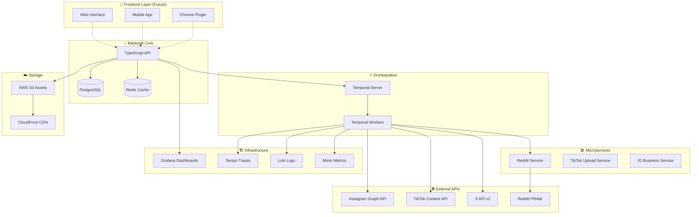

# 🏗️ Architecture OFM Social OS

## Vue d'Ensemble de l'Architecture



---

## 🎯 Flux de Données Principal

### 1. Publication Multi-Platform
```
Creator Content → API Validation → LLM Budget Check → Temporal Workflow → Platform Activities → Metrics Collection
```

### 2. KPI-Driven Repurposing  
```
Metrics Monitor → Threshold Analysis → Auto-Repurpose Decision → FFmpeg Variants → Re-publish Workflow
```

### 3. Budget Management
```
LLM Request → Cost Estimation → Budget Reservation → Usage Tracking → Alert System
```

---

## 🔧 Composants Techniques

### Backend Stack
- **API** : Express.js + TypeScript + OpenAPI
- **Database** : PostgreSQL 15+ avec multi-tenancy
- **Cache** : Redis pour sessions, rate limits, idempotence
- **Queue** : Temporal pour workflows durables
- **Auth** : OAuth 2.0 multi-platform
- **Storage** : AWS S3 pour assets + variants

### Microservices
- **Reddit Service** : Python + Flask + PRAW
- **Future Services** : Go/Node.js selon besoins

### Observability
- **Traces** : OpenTelemetry → Tempo
- **Logs** : Structured JSON → Loki
- **Metrics** : Prometheus format → Mimir  
- **Dashboards** : Grafana avec 3 dashboards


---

## 🛡️ Sécurité & Conformité

### API Security
- **Authentication** : JWT + OAuth refresh
- **Authorization** : Creator-scoped resources
- **Rate Limiting** : Per-creator + global limits
- **Input Validation** : Schema validation strict
- **HTTPS** : TLS 1.3 obligatoire

### Data Protection
- **Encryption** : At-rest + in-transit
- **PII Handling** : GDPR compliant
- **Audit Logs** : Immutable action logs
- **Backup** : Automated daily backups
- **Retention** : Configurable data retention

### Platform Compliance
- **Instagram** : Business API terms + rate limits
- **TikTok** : Content Posting API guidelines
- **X** : API v2 terms + Premium features
- **Reddit** : PRAW best practices

---

## 📊 Scalabilité & Performance

### Horizontal Scaling
- **API** : Load balancer + multiple instances
- **Workers** : Auto-scaling Temporal workers
- **Database** : Read replicas + connection pooling
- **Cache** : Redis cluster
- **Storage** : CloudFront CDN

### Performance Optimizations
- **Connection Pooling** : Database + Redis
- **Query Optimization** : Indexes + query analysis
- **Caching Strategy** : Multi-layer caching
- **Asset Optimization** : CDN + compression
- **Background Processing** : Async via Temporal

### Monitoring & Alerting
- **SLO** : 99.9% uptime target
- **Response Time** : <200ms API, <5s publishing
- **Error Rate** : <1% error rate target
- **Budget Alerts** : Proactive cost management

---

## 🔮 Roadmap Technique

### Phase 1 - MVP ✅
- [x] Multi-platform API
- [x] Temporal workflows
- [x] LLM budget system
- [x] E2E testing
- [x] Grafana observability

### Phase 2 - Scale (Q2 2025)
- [ ] React web interface
- [ ] Chrome extension
- [ ] Advanced analytics
- [ ] Multi-language support
- [ ] Enterprise features

### Phase 3 - AI Enhancement (Q3 2025)
- [ ] Content generation AI
- [ ] Optimal timing AI
- [ ] Audience targeting AI
- [ ] Performance prediction
- [ ] Auto-optimization

---

## 📋 Checklist de Déploiement

### Infrastructure Prerequisites
- [ ] PostgreSQL 15+ cluster
- [ ] Redis cluster 
- [ ] Temporal server
- [ ] Grafana + LGTM stack
- [ ] AWS S3 + CloudFront
- [ ] Load balancer + SSL certificates

### Configuration
- [ ] Environment variables
- [ ] OAuth app registrations
- [ ] Database migrations
- [ ] Grafana dashboard import
- [ ] Monitoring alerts setup

### Testing
- [ ] E2E test suite passing
- [ ] Load testing completed
- [ ] Security scan passed
- [ ] Performance benchmarks met
- [ ] Disaster recovery tested

---

*Architecture complètement alignée avec la vision OFM Social OS* ✅