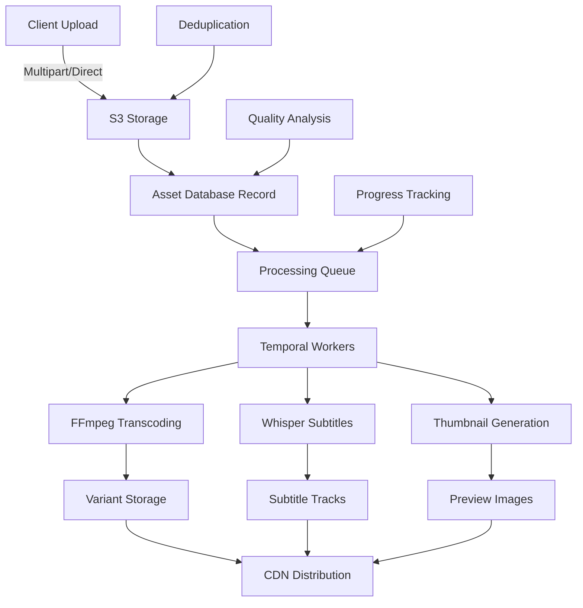

# Media Pipeline - Configuration Guide

## Overview

OFM Social OS implements a comprehensive media processing pipeline for automated video transcoding, subtitle generation, and content optimization across multiple social media platforms.

## Architecture



## Features

### Video Transcoding
- **Profiles**: 9:16 (TikTok/Stories), 1:1 (Instagram), 16:9 (YouTube/Twitter)
- **Codecs**: H.264 High Profile, AAC audio
- **Quality**: Optimized bitrates per platform
- **Audio**: EBU R128 loudness normalization
- **Containers**: MP4 with fast-start for web streaming

### Subtitle Generation
- **Engine**: OpenAI Whisper with multiple model sizes
- **Languages**: Auto-detection + manual specification
- **Formats**: SRT, VTT (WebVTT)
- **Features**: Burn-in subtitles, external tracks
- **Quality**: Confidence scoring and word-level timestamps

### Content Deduplication
- **Method**: SHA-256 content hashing
- **Scope**: Per-creator deduplication
- **Storage**: Variant hash for processed versions
- **Efficiency**: Avoids re-processing identical content

### Upload Methods
- **Direct Upload**: Single-file up to 500MB
- **Multipart Upload**: Large files with resumable chunks
- **Presigned URLs**: Direct browser-to-S3 uploads
- **Progress Tracking**: Real-time upload status

## Configuration

### Environment Variables

```bash
# Required S3 configuration
AWS_REGION=us-east-1
S3_BUCKET=ofm-media-bucket
AWS_ACCESS_KEY_ID=your-access-key-id
AWS_SECRET_ACCESS_KEY=your-secret-access-key

# Optional S3 settings
S3_ENDPOINT=http://localhost:9000  # For MinIO development
S3_SERVER_SIDE_ENCRYPTION=AES256   # Or aws:kms

# FFmpeg configuration
FFMPEG_PRESET=veryfast             # Speed vs quality tradeoff
FFMPEG_THREADS=4                   # Processing threads

# Whisper configuration  
WHISPER_MODEL=base                 # tiny|base|small|medium|large
WHISPER_DEVICE=cpu                 # cpu|cuda for GPU acceleration

# Processing limits
MAX_FILE_SIZE=500MB                # Direct upload limit
MAX_MULTIPART_SIZE=5GB             # Multipart upload limit
PROCESSING_TIMEOUT=30m             # Per-operation timeout
PARALLEL_JOBS=3                    # Concurrent processing jobs
```

### Video Profiles

```typescript
// Predefined transcoding profiles
const VIDEO_PROFILES = {
  '9x16': {
    width: 1080, height: 1920,    // TikTok, Instagram Stories
    videoBitrate: 6000,           // 6 Mbps
    audioBitrate: 128,            // 128 kbps AAC
    frameRate: 30,
    preset: 'veryfast',
    profile: 'high',
    level: '4.1'
  },
  '1x1': {
    width: 1080, height: 1080,    // Instagram Feed
    videoBitrate: 4000,           // 4 Mbps
    audioBitrate: 128,
    frameRate: 30
  },
  '16x9': {
    width: 1920, height: 1080,    // YouTube, Twitter
    videoBitrate: 5000,           // 5 Mbps
    audioBitrate: 128,
    frameRate: 30
  }
};
```

### Whisper Models

```typescript
// Whisper configuration presets
const WHISPER_CONFIGS = {
  fast: {
    model: 'base',                 // ~39 languages, fast processing
    task: 'transcribe',
    initialPrompt: 'Social media content, informal speech, slang, hashtags, mentions.'
  },
  accurate: {
    model: 'medium',               // Better accuracy, slower
    task: 'transcribe',
    initialPrompt: 'Social media content with proper punctuation and capitalization.'
  },
  multilingual: {
    model: 'large',                // Best quality, ~99 languages
    task: 'transcribe'
  }
};
```

## API Reference

### Upload Endpoints

#### Direct Upload
```http
POST /api/media/upload
Content-Type: multipart/form-data

file: [binary data]
```

Response:
```json
{
  "asset": {
    "id": "asset_123",
    "url": "https://s3.amazonaws.com/bucket/path/video.mp4",
    "kind": "video",
    "filename": "original.mp4",
    "size": 1048576,
    "uploadedAt": "2023-10-01T12:00:00Z"
  }
}
```

#### Multipart Upload
```http
# 1. Initialize
POST /api/media/multipart/init
{
  "filename": "large_video.mp4",
  "contentType": "video/mp4",
  "fileSize": 104857600
}

# 2. Get part upload URLs
POST /api/media/multipart/{sessionId}/part/{partNumber}

# 3. Complete upload
POST /api/media/multipart/{sessionId}/complete
{
  "parts": [
    { "partNumber": 1, "etag": "abc123", "size": 5242880 },
    { "partNumber": 2, "etag": "def456", "size": 5242880 }
  ]
}
```

### Processing Endpoints

#### Start Processing
```http
POST /api/media/{assetId}/process
{
  "profiles": ["9x16", "1x1"],
  "generateSubtitles": true,
  "subtitleLanguages": ["en", "es"],
  "priority": 3
}
```

Response:
```json
{
  "message": "Processing started",
  "jobs": [
    { "id": "job_123", "type": "transcode", "profile": "9x16" },
    { "id": "job_124", "type": "transcode", "profile": "1x1" },
    { "id": "job_125", "type": "subtitle" }
  ]
}
```

#### Get Asset Details
```http
GET /api/media/{assetId}
```

Response:
```json
{
  "asset": {
    "id": "asset_123",
    "kind": "video",
    "originalFilename": "video.mp4",
    "status": "ready",
    "variants": [
      {
        "id": "variant_456",
        "profile": "9x16",
        "url": "https://s3.amazonaws.com/bucket/variants/video_9x16.mp4",
        "width": 1080,
        "height": 1920,
        "status": "ready",
        "processingTime": 45000
      }
    ]
  }
}
```

### Management Endpoints

#### List Assets
```http
GET /api/media?page=1&limit=20&kind=video
```

#### Delete Asset
```http
DELETE /api/media/{assetId}
```

## Temporal Workflows

### Media Processing Workflow

```typescript
// Start processing workflow
const workflowId = `media-process-${assetId}`;
await temporal.start(processMediaWorkflow, {
  workflowId,
  args: [{
    assetId: 'asset_123',
    operations: [
      { type: 'transcode', parameters: { profiles: ['9x16'] } },
      { type: 'subtitle', parameters: { languages: ['en'] } }
    ],
    creatorId: 'creator_456'
  }]
});

// Query progress
const progress = await temporal.query(workflowId, 'getProgress');
console.log(`${progress.completedOperations}/${progress.totalOperations} complete`);

// Control workflow
await temporal.signal(workflowId, 'pauseProcessing');
await temporal.signal(workflowId, 'resumeProcessing');
await temporal.signal(workflowId, 'cancelProcessing');
```

### Specialized Workflows

#### Social Media Optimization
```typescript
await temporal.start(optimizeForSocialWorkflow, {
  args: [{
    assetId: 'asset_123',
    platforms: ['tiktok', 'instagram_stories', 'twitter'],
    locale: 'en'
  }]
});
```

#### Batch Processing
```typescript
await temporal.start(batchProcessWorkflow, {
  args: [{
    assetIds: ['asset_1', 'asset_2', 'asset_3'],
    operation: 'transcode',
    parameters: { profiles: ['9x16'] },
    parallelism: 2
  }]
});
```

## Database Schema

### Assets Table
```sql
CREATE TABLE assets (
  id UUID PRIMARY KEY,
  creator_id UUID NOT NULL,
  kind TEXT NOT NULL CHECK (kind IN ('video', 'image', 'audio')),
  original_filename TEXT,
  mime_type TEXT,
  s3_url TEXT NOT NULL,
  s3_bucket TEXT NOT NULL,
  s3_key TEXT NOT NULL,
  width INTEGER,
  height INTEGER,
  duration DECIMAL(10,3),
  file_size_bytes BIGINT,
  content_hash TEXT NOT NULL UNIQUE,
  status TEXT NOT NULL DEFAULT 'uploaded',
  processing_metadata JSONB DEFAULT '{}',
  created_at TIMESTAMPTZ DEFAULT now()
);
```

### Variants Table
```sql
CREATE TABLE variants (
  id UUID PRIMARY KEY,
  asset_id UUID REFERENCES assets(id) ON DELETE CASCADE,
  profile TEXT NOT NULL,
  s3_url TEXT NOT NULL,
  width INTEGER,
  height INTEGER,
  bitrate_kbps INTEGER,
  duration DECIMAL(10,3),
  file_size_bytes BIGINT,
  variant_hash TEXT NOT NULL UNIQUE,
  ffmpeg_cmd TEXT,
  processing_time_ms INTEGER,
  status TEXT NOT NULL DEFAULT 'pending',
  created_at TIMESTAMPTZ DEFAULT now(),
  UNIQUE(asset_id, profile)
);
```

### Subtitle Tracks Table
```sql
CREATE TABLE subtitle_tracks (
  id UUID PRIMARY KEY,
  variant_id UUID REFERENCES variants(id) ON DELETE CASCADE,
  language_code TEXT NOT NULL,
  format TEXT NOT NULL CHECK (format IN ('srt', 'vtt', 'mov_text')),
  s3_url TEXT,
  embedded BOOLEAN DEFAULT false,
  auto_generated BOOLEAN DEFAULT false,
  confidence_score DECIMAL(4,3),
  word_count INTEGER,
  transcription_metadata JSONB DEFAULT '{}',
  created_at TIMESTAMPTZ DEFAULT now(),
  UNIQUE(variant_id, language_code, format)
);
```

## Performance Optimization

### Deduplication Strategy

```typescript
// Content deduplication
const contentHash = crypto.createHash('sha256')
  .update(fileBuffer)
  .digest('hex');

// Check existing assets
const existing = await db.query(
  'SELECT id, s3_url FROM assets WHERE content_hash = $1 AND creator_id = $2',
  [contentHash, creatorId]
);

if (existing.rows.length > 0) {
  return { duplicate: true, assetId: existing.rows[0].id };
}
```

### Variant Deduplication

```typescript
// Avoid re-processing same transcode operations
const variantHash = crypto.createHash('sha256')
  .update(`${contentHash}|${profile}|${normalizedFFmpegCmd}`)
  .digest('hex');

const existingVariant = await db.query(
  'SELECT id FROM variants WHERE variant_hash = $1',
  [variantHash]
);
```

### Parallel Processing

```typescript
// Process multiple profiles concurrently
const transcodePromises = profiles.map(profile => 
  temporal.start(transcodeActivity, { assetId, profile })
);

const results = await Promise.allSettled(transcodePromises);
```

## Monitoring and Metrics

### Key Metrics

```prometheus
# Upload metrics
media_upload_total{method="direct|multipart", kind="video|image|audio"}
media_upload_size_bytes{method="direct|multipart"}
media_upload_duration_ms{method="direct|multipart"}

# Processing metrics
media_transcode_total{profile="9x16|1x1|16x9", status="success|error"}
media_transcode_duration_ms{profile="9x16|1x1|16x9"}
media_subtitle_total{language="en|es|fr", status="success|error"}
media_subtitle_confidence{}

# Storage metrics
media_storage_used_bytes{creator_id}
media_deduplication_rate{}

# Queue metrics
media_queue_depth{operation="transcode|subtitle|thumbnail"}
media_queue_processing_time_ms{operation}
```

### Health Checks

```http
GET /health/media
```

Response:
```json
{
  "status": "healthy",
  "checks": {
    "s3": { "healthy": true, "latency": 45 },
    "ffmpeg": { "installed": true, "version": "4.4.2" },
    "whisper": { "installed": true, "version": "20231117" },
    "temporal": { "connected": true, "workers": 3 },
    "database": { "connected": true, "pool_size": 10 }
  }
}
```

## Error Handling

### Common Issues

**Upload Failures**:
- File size exceeds limits
- Unsupported MIME types
- S3 connectivity issues
- Multipart upload timeouts

**Processing Failures**:
- Corrupted input files
- FFmpeg crashes
- Whisper model loading errors
- Insufficient disk space

**Recovery Strategies**:
- Automatic retries with exponential backoff
- Dead letter queue for failed jobs
- Manual retry endpoints
- Cleanup of partial uploads

### Debug Commands

```bash
# Check FFmpeg installation
ffmpeg -version

# Test video info extraction
ffprobe -v quiet -print_format json -show_format input.mp4

# Check Whisper installation
whisper --version

# Test S3 connectivity
aws s3 ls s3://your-bucket-name/

# Monitor processing queue
curl -s http://localhost:3000/api/admin/media/queue | jq '.stats'
```

## Security Considerations

### Access Control
- Creator-scoped asset access
- Presigned URL expiration (1 hour)
- CORS configuration for browser uploads
- Rate limiting on upload endpoints

### Data Protection
- Server-side encryption (SSE-S3/KMS)
- Content hash verification
- Secure temporary file handling
- Audit logging for all operations

### Privacy
- Auto-cleanup of temporary files
- Retention policies for processed content
- GDPR-compliant deletion
- No logging of file contents

---

**Last Updated**: 2025-08-12  
**Version**: 1.0  
**Owner**: Backend Team