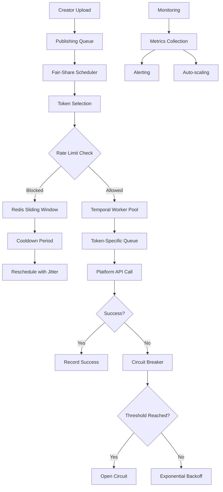

# Multi-Account Scaling - Configuration Guide

## Overview

OFM Social OS implements advanced multi-account scaling with token-based partitioning, Redis sliding window rate limiting, fair-share scheduling, and circuit breaker protection. Each social media account gets its own Temporal task queue with dedicated rate limiting and failure isolation.

## Architecture



## Key Features

### Token-Based Partitioning
- **Dedicated Queues**: Each token gets `publish:{platform}:{tokenId}` queue
- **Isolated Workers**: Separate Temporal workers per token prevent noisy neighbor
- **Independent Scaling**: Workers auto-scale based on token activity
- **Circuit Protection**: Per-token circuit breakers prevent cascade failures

### Sliding Window Rate Limiting
- **Redis-Based**: Accurate sliding windows using sorted sets
- **Multi-Window**: Burst (60s), minute, hour, day limits simultaneously
- **Platform-Specific**: TikTok (1/min), Instagram (5/min), Twitter (300/min)
- **Graceful Degradation**: Fail-open on Redis errors

### Fair-Share Scheduling
- **Round-Robin**: Weighted round-robin with priority consideration
- **Anti-Starvation**: Ensures all active tokens get scheduled
- **Human Jitter**: 30-90 minute randomization for natural posting
- **Backoff**: Exponential backoff for failed tokens

### Circuit Breaker Protection
- **Per-Token State**: Independent circuit breakers prevent token-level failures
- **Auto-Recovery**: Half-open state for gradual recovery testing
- **Configurable Thresholds**: 5 failures trigger open state, 5-minute cooldown
- **Metrics Integration**: Real-time failure tracking and alerting

## Configuration

### Environment Variables

```bash
# Redis Configuration (for rate limiting)
REDIS_URL=redis://localhost:6379
REDIS_CLUSTER_ENABLED=false
REDIS_KEY_PREFIX=ofm:rl:

# Temporal Configuration
TEMPORAL_ADDRESS=localhost:7233
TEMPORAL_NAMESPACE=default
TEMPORAL_TASK_QUEUE_PREFIX=publish

# Worker Configuration
WORKER_MAX_CONCURRENT_ACTIVITIES=50
WORKER_MAX_TASK_QUEUE_ACTIVITIES_PER_SECOND=10
WORKER_AUTO_SCALING_ENABLED=true
WORKER_SCALING_INTERVAL_SECONDS=120

# Rate Limiting
RATE_LIMIT_ENABLED=true
RATE_LIMIT_FAIL_OPEN=true
RATE_LIMIT_CLEANUP_INTERVAL_HOURS=24

# Circuit Breaker
CIRCUIT_BREAKER_ENABLED=true
CIRCUIT_BREAKER_FAILURE_THRESHOLD=5
CIRCUIT_BREAKER_TIMEOUT_SECONDS=300
CIRCUIT_BREAKER_HALF_OPEN_MAX_CALLS=3

# Jitter Configuration
JITTER_MIN_MINUTES=30
JITTER_MAX_MINUTES=90
JITTER_ENABLED=true

# Monitoring
METRICS_ENABLED=true
PROMETHEUS_PORT=9090
HEALTH_CHECK_INTERVAL_SECONDS=30
```

### Platform Rate Limits

Rate limits are stored in `platform_rate_limits` table and loaded dynamically:

```sql
-- TikTok Content Posting API (strict 1-minute sliding window)
INSERT INTO platform_rate_limits (platform, endpoint, limit_per_minute, limit_per_hour, limit_per_day, burst_limit) VALUES
('tiktok', 'publish', 1, 100, 1000, 2);

-- Instagram Basic Display + Graph API
('instagram', 'publish', 5, 200, 1440, 10);

-- Twitter API v2 (generous limits)
('twitter', 'publish', 300, 300, 300, 300);

-- Reddit PRAW (conservative)
('reddit', 'submit', 1, 10, 100, 1);
```

## Redis Sliding Window Implementation

### Key Structure
```
rl:{platform}:{tokenId}:{endpoint}:{window}
```

Examples:
- `rl:tiktok:uuid-123:publish:minute`
- `rl:instagram:uuid-456:upload:hour`
- `rl:twitter:uuid-789:publish:burst`

### Algorithm
```typescript
// Clean expired entries and count current requests
const now = Date.now();
const windowStart = now - (windowSeconds * 1000);

await redis.zremrangebyscore(key, 0, windowStart);
const count = await redis.zcard(key);
const allowed = count < limit;

if (allowed) {
  // Record request with unique identifier
  await redis.zadd(key, now, `${now}.${Math.random()}`);
  await redis.pexpire(key, windowSeconds * 1000 * 2);
}
```

### Benefits
- **Accurate Rate Limiting**: True sliding windows vs fixed buckets
- **Burst Protection**: Separate burst limits for short-term spikes  
- **Memory Efficient**: Automatic cleanup with TTL
- **Atomic Operations**: Pipeline operations prevent race conditions

## Fair-Share Scheduling

### Token Selection Algorithm

```sql
-- Database function for fair scheduling
SELECT token_id 
FROM token_scheduling
WHERE platform = $1 
  AND is_active = true
  AND (cooldown_until IS NULL OR cooldown_until < now())
  AND circuit_breaker_state != 'open'
ORDER BY 
  priority ASC,                          -- Higher priority first
  (last_scheduled_at IS NULL) DESC,     -- Never-scheduled first
  last_scheduled_at ASC NULLS FIRST,    -- Round-robin oldest
  weight DESC,                           -- Higher weight more frequent
  random()                               -- Final tiebreaker
LIMIT 1;
```

### Jitter Application

```typescript
// Human-like posting intervals
const calculateJitter = (minMs: number, maxMs: number): number => {
  return Math.floor(Math.random() * (maxMs - minMs + 1)) + minMs;
};

// Default: 30-90 minutes for natural social media posting
const jitter = calculateJitter(30 * 60 * 1000, 90 * 60 * 1000);
const executeAt = new Date(Date.now() + jitter);
```

### Anti-Starvation Protection

```sql
-- Detect starved tokens (not scheduled in 2+ hours)
SELECT COUNT(*) as starved_tokens
FROM token_scheduling
WHERE platform = $1 
  AND is_active = true
  AND (last_scheduled_at IS NULL OR last_scheduled_at < now() - INTERVAL '2 hours');
```

## Worker Management

### Auto-Scaling Logic

```typescript
// Scale workers based on active tokens
const activeTokens = await pool.query(`
  SELECT token_id FROM token_scheduling
  WHERE platform = $1 
    AND is_active = true
    AND (cooldown_until IS NULL OR cooldown_until < now())
    AND circuit_breaker_state != 'open'
`, [platform]);

// Start workers for new tokens
for (const tokenId of newTokens) {
  await workerManager.startWorkerForToken({
    platform,
    tokenId,
    maxConcurrentActivities: 50,
    maxTaskQueueActivitiesPerSecond: 10
  });
}
```

### Worker Configuration

```typescript
const worker = await Worker.create({
  taskQueue: `publish:${platform}:${tokenId}`,
  maxTaskQueueActivitiesPerSecond: 10,    // Rate limit at queue level
  maxConcurrentActivityTaskExecutions: 50, // Concurrency control
  activities: {
    publishPost: wrapWithRateLimit(publishPost, config),
    uploadMedia: wrapWithRateLimit(uploadMedia, config)
  }
});
```

## Circuit Breaker Implementation

### State Machine

```
Closed ──(5 failures)──> Open ──(5 min timeout)──> Half-Open
  ↑                                                      │
  └──(success)────────────────────(3 successes)─────────┘
  └──(failure)────────────────────(1 failure)──────> Open
```

### Database Tracking

```sql
-- Record failure and update circuit breaker
UPDATE token_scheduling
SET 
  total_jobs_failed = total_jobs_failed + 1,
  circuit_breaker_failures = circuit_breaker_failures + 1,
  circuit_breaker_state = CASE 
    WHEN circuit_breaker_failures + 1 >= 5 THEN 'open'
    ELSE circuit_breaker_state
  END,
  cooldown_until = CASE
    WHEN circuit_breaker_failures + 1 >= 5 THEN now() + INTERVAL '5 minutes'
    ELSE cooldown_until
  END
WHERE token_id = $1 AND platform = $2;
```

## API Endpoints

### Admin Scaling Management

#### Rate Limit Status
```http
GET /api/admin/scaling/rate-limits?platform=tiktok&timeframe=1h
```

#### Reset Rate Limits
```http
POST /api/admin/scaling/rate-limits/reset
{
  "tokenId": "uuid-123",
  "platform": "tiktok",
  "endpoint": "publish"
}
```

#### Update Platform Limits
```http
PUT /api/admin/scaling/platform-limits
{
  "platform": "tiktok",
  "endpoint": "publish", 
  "limitPerMinute": 2,
  "burstLimit": 3
}
```

#### Scheduler Metrics
```http
GET /api/admin/scaling/scheduler/metrics?platform=tiktok
```

Response:
```json
{
  "metrics": {
    "activeTokens": 25,
    "totalJobsScheduled": 1500,
    "avgJobDuration": 2500,
    "circuitBreakerOpen": 2,
    "rateLimitHits24h": 8
  },
  "fairnessStatus": {
    "isHealthy": true,
    "starvedTokens": 0,
    "maxStarvationMinutes": 45
  }
}
```

#### Worker Scaling
```http
POST /api/admin/scaling/workers/scale
{
  "platform": "tiktok",
  "action": "scale_up"
}
```

#### Queue Statistics
```http
GET /api/admin/scaling/queues/statistics?platform=instagram
```

#### System Health
```http
GET /api/admin/scaling/health
```

Response:
```json
{
  "healthy": true,
  "components": {
    "rateLimiter": { "healthy": true, "latency": 15 },
    "scheduler": { "healthy": true, "issues": [] },
    "workers": { "healthy": true, "totalWorkers": 48 }
  }
}
```

## Monitoring and Alerting

### Key Metrics

```prometheus
# Rate Limiting
rate_limit_requests_total{platform, endpoint}
rate_limit_exceeded_total{platform, endpoint, window_type}
rate_limit_window_count{platform, endpoint, window_type}

# Scheduling
scheduler_tokens_selected_total{platform}
scheduler_jobs_scheduled_total{platform, endpoint}
scheduler_job_duration_ms{platform}
scheduler_jitter_ms{platform}
scheduler_job_failures_total{platform}
scheduler_job_successes_total{platform}

# Workers
temporal_workers_started_total{platform}
temporal_workers_stopped_total{platform}
temporal_workers_active{platform}
temporal_activity_total{activity, platform, status}
temporal_activity_duration_ms{activity, platform}

# Circuit Breakers
circuit_breaker_state{platform, token_id, state}
circuit_breaker_failures_total{platform}
circuit_breaker_recoveries_total{platform}
```

### Grafana Dashboard

```json
{
  "dashboard": {
    "title": "Multi-Account Scaling",
    "panels": [
      {
        "title": "Rate Limit Hit Rate",
        "targets": [
          "rate(rate_limit_exceeded_total[5m]) / rate(rate_limit_requests_total[5m])"
        ]
      },
      {
        "title": "Active Workers by Platform", 
        "targets": ["temporal_workers_active"]
      },
      {
        "title": "Circuit Breaker Status",
        "targets": ["circuit_breaker_state == 1"]
      },
      {
        "title": "Token Fairness",
        "targets": ["scheduler_tokens_selected_total"]
      }
    ]
  }
}
```

### Alerts

```yaml
groups:
- name: scaling
  rules:
  # High rate limit hit rate
  - alert: HighRateLimitHitRate
    expr: rate(rate_limit_exceeded_total[5m]) / rate(rate_limit_requests_total[5m]) > 0.1
    for: 2m
    annotations:
      summary: "High rate limit hit rate: {{ $value }}%"
  
  # Too many circuit breakers open
  - alert: CircuitBreakersOpen
    expr: sum(circuit_breaker_state{state="open"}) > 5
    for: 1m
    annotations:
      summary: "{{ $value }} circuit breakers are open"
  
  # Token starvation
  - alert: TokenStarvation  
    expr: increase(scheduler_tokens_selected_total[1h]) == 0
    for: 30m
    annotations:
      summary: "No tokens scheduled in last hour for {{ $labels.platform }}"
  
  # Worker scaling issues
  - alert: WorkerScalingFailure
    expr: increase(temporal_worker_errors_total[5m]) > 3
    for: 1m
    annotations:
      summary: "Worker scaling failures detected"
```

## Performance Tuning

### Redis Optimization

```bash
# Redis memory optimization for sliding windows
redis-cli CONFIG SET maxmemory 2gb
redis-cli CONFIG SET maxmemory-policy allkeys-lru

# Pipeline size for bulk operations
redis-cli CONFIG SET tcp-keepalive 60

# Persistence for rate limit durability
redis-cli CONFIG SET save "900 1 300 10 60 1000"
```

### Worker Scaling

```typescript
// Platform-specific worker configuration
const WORKER_CONFIGS = {
  tiktok: {
    maxConcurrentActivities: 20,      // Lower due to strict rate limits
    maxTaskQueueActivitiesPerSecond: 1, // 1/min strict limit
    scalingFactor: 1.0                // Conservative scaling
  },
  instagram: {
    maxConcurrentActivities: 50,      // Higher throughput
    maxTaskQueueActivitiesPerSecond: 5,  // 5/min limit
    scalingFactor: 1.2                // Aggressive scaling
  },
  twitter: {
    maxConcurrentActivities: 100,     // Highest throughput
    maxTaskQueueActivitiesPerSecond: 50, // Very high limits
    scalingFactor: 1.5                // Most aggressive
  }
};
```

### Database Indexes

```sql
-- Optimize token selection query
CREATE INDEX CONCURRENTLY idx_token_scheduling_selection 
ON token_scheduling (platform, is_active, priority, last_scheduled_at, cooldown_until)
WHERE is_active = true;

-- Optimize rate limit event queries  
CREATE INDEX CONCURRENTLY idx_rate_limit_events_sliding_window
ON rate_limit_events (token_id, platform, endpoint, hit_at DESC);

-- Optimize queue statistics
CREATE INDEX CONCURRENTLY idx_queue_statistics_active
ON queue_statistics (platform, last_activity_at DESC, circuit_breaker_state);
```

## Cost Analysis

### Infrastructure Costs

| Component | Scaling Factor | Monthly Cost (100 tokens) |
|-----------|-----------------|---------------------------|
| Redis Cluster | 1x per environment | $150 (r6g.large) |
| Temporal Workers | 1x per active token | $800 (t3.medium × 50) |
| Database Storage | 10GB rate limit events | $20 (RDS storage) |
| Monitoring | 1x overhead | $100 (CloudWatch/Grafana) |
| **Total** | | **$1,070/month** |

### Scaling Projections

| Token Count | Workers Needed | Monthly Cost | Cost/Token |
|-------------|----------------|--------------|------------|
| 100 | 50 | $1,070 | $10.70 |
| 500 | 250 | $4,500 | $9.00 |
| 1,000 | 500 | $8,500 | $8.50 |
| 5,000 | 2,500 | $40,000 | $8.00 |

### Optimization Strategies

1. **Shared Workers**: Group similar tokens by activity patterns
2. **Spot Instances**: 60-70% cost reduction for non-critical workers  
3. **Regional Scaling**: Deploy workers closer to platform APIs
4. **Intelligent Scaling**: Scale down during low-activity hours

## Troubleshooting

### Common Issues

**Rate Limit Exceeded**:
```bash
# Check current rate limit status
curl -H "Authorization: Bearer $ADMIN_TOKEN" \
  "$API_URL/admin/scaling/rate-limits/token-123/tiktok/publish"

# Reset if necessary
curl -X POST -H "Authorization: Bearer $ADMIN_TOKEN" \
  -d '{"tokenId":"token-123","platform":"tiktok"}' \
  "$API_URL/admin/scaling/rate-limits/reset"
```

**Circuit Breaker Stuck Open**:
```sql
-- Check circuit breaker status
SELECT token_id, platform, circuit_breaker_state, 
       circuit_breaker_failures, cooldown_until
FROM token_scheduling 
WHERE circuit_breaker_state = 'open';

-- Manually reset if needed
UPDATE token_scheduling 
SET circuit_breaker_state = 'closed', 
    circuit_breaker_failures = 0,
    cooldown_until = NULL
WHERE token_id = 'token-123' AND platform = 'tiktok';
```

**Worker Not Scaling**:
```bash
# Check worker status
curl "$API_URL/admin/scaling/workers/status"

# Force scaling
curl -X POST -d '{"platform":"tiktok","action":"scale_up"}' \
  "$API_URL/admin/scaling/workers/scale"
```

**Token Starvation**:
```sql
-- Find starved tokens
SELECT token_id, platform, last_scheduled_at,
       EXTRACT(EPOCH FROM (now() - last_scheduled_at))/3600 as hours_since_scheduled
FROM token_scheduling 
WHERE is_active = true 
  AND last_scheduled_at < now() - INTERVAL '2 hours'
ORDER BY last_scheduled_at ASC;
```

### Debug Commands

```bash
# Redis sliding window inspection
redis-cli ZRANGE "rl:tiktok:token-123:publish:minute" 0 -1 WITHSCORES

# Check worker health
temporal workflow list --query "TaskQueue='publish:tiktok:token-123'"

# Monitor metrics
curl -s localhost:9090/metrics | grep rate_limit

# Database performance
SELECT * FROM pg_stat_user_tables WHERE relname LIKE '%rate_limit%';
```

## Security Considerations

### Token Isolation
- Each token has dedicated queues preventing cross-contamination
- Circuit breakers prevent one token's failures affecting others
- Rate limits enforced per-token to prevent quota stealing

### Data Protection  
- Rate limit events stored with 7-day retention
- No sensitive token data in Redis (only hashed identifiers)
- Admin API requires role-based access control

### Failure Recovery
- Redis failures fail-open to prevent service disruption
- Database connection pooling prevents connection exhaustion
- Worker auto-restart on crashes with exponential backoff

---

**Last Updated**: 2025-08-12  
**Version**: 1.0  
**Owner**: Backend Team