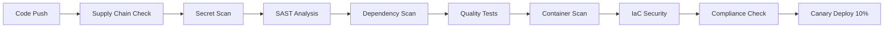

# CI/CD Security Implementation Guide

## Overview

This document outlines the comprehensive CI/CD security implementation for OFM Social OS, including supply chain security, SBOM generation, vulnerability scanning, and deployment practices.

## Security Pipeline Architecture



## Pipeline Components

### 1. Supply Chain Security

#### Software Bill of Materials (SBOM)
- **Tool**: Anchore SBOM Action
- **Format**: SPDX JSON
- **Frequency**: Every build
- **Coverage**: All dependencies (direct and transitive)

```yaml
# Generates comprehensive SBOM for compliance
- name: Generate SBOM
  uses: anchore/sbom-action@v0
  with:
    path: ./marketing
    format: spdx-json
    upload-artifact: true
```

#### Dependency Auditing
- **npm audit**: Moderate/high severity vulnerabilities
- **License compliance**: Allow-list approach (MIT, Apache-2.0, BSD)
- **Automated updates**: Dependabot with security grouping

### 2. Static Application Security Testing (SAST)

#### CodeQL Analysis
- **Languages**: TypeScript, JavaScript
- **Queries**: Security-extended and quality rules
- **Integration**: GitHub Security tab
- **Alerting**: Automatic issue creation for critical findings

#### Semgrep Security Scanning
- **Rulesets**:
  - Security audit patterns
  - Secret detection
  - SQL injection prevention
  - Command injection detection
  - Dockerfile security

#### ESLint Security Rules
- **Plugin**: eslint-plugin-security
- **Rules**: Object injection, regex vulnerabilities, timing attacks
- **Output**: SARIF format for GitHub Security

### 3. Secret Detection

#### Multi-layered Approach
1. **TruffleHog**: High-confidence secret detection
2. **detect-secrets**: Baseline and audit workflow
3. **GitLeaks**: Custom rules for platform-specific tokens
4. **GitHub native**: Built-in secret scanning

#### Custom Detection Rules
```toml
# Instagram access tokens
[[rules]]
id = "instagram-access-token"
regex = '''IGQVJ[A-Za-z0-9_-]{100,}'''

# TikTok API tokens
[[rules]]
id = "tiktok-access-token"
regex = '''act\.[a-f0-9]{32}'''
```

### 4. Dependency Vulnerability Scanning

#### Snyk Integration
- **Severity threshold**: High and critical only
- **Output**: SARIF for GitHub Security
- **Policy**: Fail build on critical vulnerabilities
- **Monitoring**: Continuous monitoring in production

#### OSV Scanner
- **Database**: Google's Open Source Vulnerabilities
- **Coverage**: All package ecosystems
- **Output**: SARIF format
- **Frequency**: Every build and daily scheduled

### 5. Container Security

#### Multi-stage Scanning
```dockerfile
# Security-hardened Dockerfile
FROM node:20-alpine AS runtime
RUN adduser -S api -u 1001 -G nodejs
USER api  # Non-root execution
HEALTHCHECK --interval=30s CMD node healthcheck.js
```

#### Vulnerability Scanning
- **Trivy**: Container image vulnerabilities
- **Docker Scout**: CVE detection and remediation advice
- **Checkov**: Infrastructure-as-Code security
- **Terrascan**: Additional IaC validation

### 6. Quality and Testing

#### Test Coverage Requirements
- **Unit tests**: >80% coverage
- **Integration tests**: Critical paths
- **Security tests**: RLS isolation, auth flows
- **E2E tests**: OAuth flows, webhook processing

#### Quality Gates
- **SonarCloud**: Code quality and security hotspots
- **Codecov**: Coverage reporting and trends
- **TypeScript**: Strict mode with security-focused rules

## Security Compliance Checks

### GDPR Compliance Validation
```bash
# Automated GDPR compliance check
grep -r "deleteUserData\|erasePersonalData" ./src/
grep -r "personal.*data\|pii\|gdpr" ./src/
```

### Security Headers Validation
- **Helmet**: Security middleware verification
- **CORS**: Cross-origin policy validation
- **CSP**: Content Security Policy implementation

### Rate Limiting Verification
- **express-rate-limit**: Implementation check
- **Platform-specific**: TikTok 1-minute windows
- **Redis**: Distributed rate limiting

## Deployment Security

### Canary Deployment (10% Traffic)
```yaml
# Gradual rollout with monitoring
- name: Deploy Canary
  run: |
    # Deploy to canary environment
    aws ecs update-service --desired-count 1
    
    # Configure traffic splitting
    aws elbv2 modify-listener --default-actions '{
      "TargetGroups": [
        {"TargetGroupArn": "$CANARY_ARN", "Weight": 10},
        {"TargetGroupArn": "$PROD_ARN", "Weight": 90}
      ]
    }'
```

### Production Security
- **Container signing**: Cosign signatures
- **Runtime security**: Falco monitoring
- **Network policies**: Zero-trust networking
- **Secrets management**: AWS Secrets Manager integration

## Monitoring and Alerting

### Security Metrics
```yaml
# Key security indicators
error_rate_5xx: < 1%
vulnerability_scan_failures: 0
secret_detection_alerts: 0
compliance_violations: 0
```

### Notification Channels
- **Slack**: #security-alerts channel
- **GitHub Issues**: Automatic creation for failures
- **Email**: Security team notifications
- **PagerDuty**: Critical security incidents

## Security Workflows

### Daily Security Checks
- **Schedule**: 2 AM UTC daily
- **Dependencies**: Update check and vulnerability scan
- **Licenses**: Compliance validation
- **Containers**: Base image security updates

### Weekly Security Audit
- **Penetration testing**: Automated security tests
- **Dependency updates**: Dependabot PRs review
- **Policy compliance**: GDPR and security headers
- **Incident review**: Security events analysis

## Incident Response

### Security Pipeline Failure
1. **Immediate**: Stop deployment pipeline
2. **Triage**: Security team assessment
3. **Fix**: Address critical vulnerabilities
4. **Validation**: Re-run security scans
5. **Deploy**: Resume with additional monitoring

### Critical Vulnerability Detection
1. **Alert**: Slack and PagerDuty notification
2. **Assessment**: CVSS score and exploitability
3. **Patching**: Emergency hotfix deployment
4. **Monitoring**: Enhanced security monitoring
5. **Review**: Post-incident analysis

## Tools and Integrations

### Security Tools Stack
```yaml
SAST:
  - CodeQL (GitHub native)
  - Semgrep (Community rules)
  - ESLint Security Plugin

Secrets:
  - TruffleHog
  - detect-secrets
  - GitLeaks
  - GitHub Secret Scanning

Dependencies:
  - Snyk
  - OSV Scanner
  - npm audit
  - Dependabot

Containers:
  - Trivy
  - Docker Scout
  - Checkov
  - Terrascan

Quality:
  - SonarCloud
  - Codecov
  - Jest (testing)
  - Playwright (E2E)
```

### GitHub Security Features
- **Security tab**: Centralized vulnerability view
- **Dependabot alerts**: Automated dependency updates
- **Secret scanning**: Real-time secret detection
- **Code scanning**: SARIF results integration

## Best Practices

### Secure Development
1. **Shift-left security**: Early vulnerability detection
2. **Fail fast**: Stop builds on critical issues
3. **Zero tolerance**: No critical vulnerabilities in production
4. **Defense in depth**: Multiple security layers
5. **Continuous monitoring**: Runtime security validation

### Pipeline Optimization
1. **Parallel execution**: Security scans run concurrently
2. **Caching**: Docker layer and dependency caching
3. **Conditional execution**: Skip scans on documentation changes
4. **Resource limits**: Prevent resource exhaustion attacks

### Compliance Automation
1. **Policy as code**: Automated compliance checks
2. **Evidence collection**: Audit trail generation
3. **Reporting**: Automated compliance reporting
4. **Continuous validation**: Real-time policy enforcement

## Metrics and KPIs

### Security Metrics
- **Mean Time to Detection (MTTD)**: < 15 minutes
- **Mean Time to Response (MTTR)**: < 4 hours
- **Vulnerability Remediation Time**: < 24 hours (critical), < 7 days (high)
- **False Positive Rate**: < 10%

### Quality Metrics
- **Build Success Rate**: > 95%
- **Test Coverage**: > 80%
- **Security Test Coverage**: > 90%
- **Deployment Frequency**: Daily (with security validation)

## Future Enhancements

### Short Term (1-3 months)
1. **DAST integration**: Dynamic application security testing
2. **API security testing**: Automated API vulnerability scanning
3. **Infrastructure monitoring**: Runtime security monitoring
4. **Supply chain attestation**: SLSA compliance

### Long Term (3-12 months)
1. **Zero-trust architecture**: Complete network segmentation
2. **Behavioral analytics**: AI-powered anomaly detection
3. **Threat modeling automation**: Continuous threat assessment
4. **Security chaos engineering**: Proactive security testing

---

**Document Version**: 1.0  
**Last Updated**: 2025-08-12  
**Next Review**: 2025-11-12  
**Owner**: DevSecOps Team  
**Approved By**: CTO & CISO