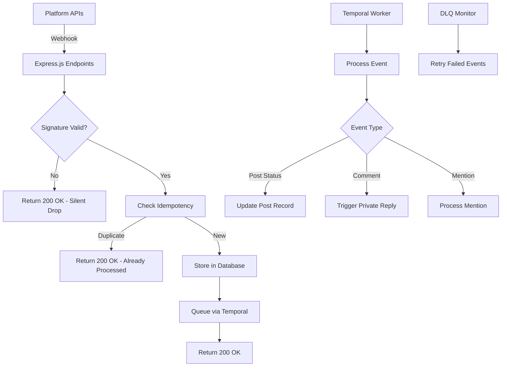

# Webhook Engine - Configuration Guide

## Overview

OFM Social OS implements a reliable, idempotent webhook engine for processing platform notifications from TikTok Content Posting API and Meta/Instagram Graph API.

## Architecture



## Supported Platforms

### TikTok Content Posting API
- **Events**: `video.publish.complete`, `video.publish.failed`, `video.moderation.update`
- **Signature**: HMAC-SHA256 with `t=timestamp,s=signature` format
- **Timeout tolerance**: 5 minutes

### Meta/Instagram Graph API
- **Events**: Comments, mentions, messages (if permissions granted)
- **Signature**: HMAC-SHA256 with `X-Hub-Signature-256` header
- **Handshake**: GET endpoint for webhook verification

### Reddit
No official webhooks - uses polling instead.

## Configuration

### Environment Variables

```bash
# Required webhook secrets
WEBHOOK_SECRET=your-64-char-hex-webhook-secret-here
META_VERIFY_TOKEN=your-meta-webhook-verify-token-here

# Platform secrets (for signature verification)
TIKTOK_CLIENT_SECRET=your-tiktok-client-secret
META_APP_SECRET=your-meta-app-secret

# Feature flags (optional)
DISABLE_TIKTOK_WEBHOOKS=false
DISABLE_META_WEBHOOKS=false
```

### Generate Webhook Secrets

```bash
# Generate webhook secret (64 hex chars)
openssl rand -hex 32

# Generate Meta verify token (any string)
openssl rand -base64 32
```

## Platform Setup

### TikTok Developer Portal

1. Go to [TikTok for Developers](https://developers.tiktok.com/)
2. Navigate to your app → Content Posting API
3. Set webhook URL: `https://your-domain.com/webhooks/tiktok`
4. Configure events:
   - `video.publish.complete`
   - `video.publish.failed` 
   - `video.moderation.update`
5. Save your `client_secret` for signature verification

### Meta App Dashboard

1. Go to [Meta for Developers](https://developers.facebook.com/)
2. Navigate to your app → Products → Webhooks
3. Set callback URL: `https://your-domain.com/webhooks/meta`
4. Set verify token (use `META_VERIFY_TOKEN` value)
5. Subscribe to fields:
   - `comments`
   - `mentions`
   - `messages` (optional)
6. Save your `app_secret` for signature verification

## Endpoints

### TikTok Webhook Endpoint

```http
POST /webhooks/tiktok
Content-Type: application/json
TikTok-Signature: t=1634567890,s=abc123...

{
  "event": {
    "event_id": "event_12345",
    "type": "video.publish.complete",
    "account": { "username": "creator_handle" },
    "video": { "id": "video_67890" },
    "metrics": {
      "view_count": 1000,
      "like_count": 50,
      "comment_count": 10,
      "share_count": 5
    }
  }
}
```

### Meta Webhook Endpoints

**Verification (GET)**:
```http
GET /webhooks/meta?hub.mode=subscribe&hub.verify_token=YOUR_TOKEN&hub.challenge=CHALLENGE_STRING
```

**Events (POST)**:
```http
POST /webhooks/meta
Content-Type: application/json
X-Hub-Signature-256: sha256=abc123...

{
  "entry": [{
    "id": "instagram_account_id",
    "time": 1634567890,
    "changes": [{
      "field": "comments",
      "value": {
        "id": "comment_123",
        "text": "Great post!",
        "from": {
          "id": "user_456",
          "username": "commenter"
        }
      }
    }]
  }]
}
```

## Security

### Signature Verification

All webhooks are verified using HMAC-SHA256:

```typescript
// TikTok signature format: "t=timestamp,s=signature"
const signedPayload = `${timestamp}.${rawBody}`;
const expectedSignature = crypto
  .createHmac('sha256', TIKTOK_CLIENT_SECRET)
  .update(signedPayload)
  .digest('hex');

// Meta signature format: "sha256=signature"  
const expectedSignature = 'sha256=' + crypto
  .createHmac('sha256', META_APP_SECRET)
  .update(rawBody)
  .digest('hex');
```

### Timestamp Validation

TikTok webhooks include timestamp validation:
- **Tolerance**: ±5 minutes
- **Purpose**: Prevent replay attacks
- **Implementation**: Compare webhook timestamp with current time

### Idempotency

All webhook events are idempotent:
- **Event ID**: Used as unique identifier
- **Database**: Prevents duplicate processing
- **Redis cache**: Fast duplicate detection (24h TTL)

## Rate Limiting

Webhook endpoints have protective rate limiting:
- **Limit**: 50 requests/second per endpoint
- **Burst**: Allowed for legitimate traffic spikes
- **Response**: 429 Too Many Requests

## Monitoring

### Metrics

Key metrics exposed via Prometheus:

```
# Total webhooks received
webhook_received_total{provider="tiktok|meta", event_type="..."}

# Signature verification errors  
webhook_sig_errors_total{provider="tiktok|meta"}

# Processing time
webhook_lag_ms{provider="tiktok|meta"}

# Dead letter queue depth
webhook_dlq_depth{provider="tiktok|meta"}

# Acknowledgment time (should be < 1000ms)
webhook_ack_time_ms{provider="tiktok|meta"}
```

### Alerts

Configure alerts for:
- **High error rate**: `webhook_sig_errors_total` increase
- **Slow ACK**: `webhook_ack_time_ms` p95 > 1000ms
- **DLQ buildup**: `webhook_dlq_depth` > 10
- **Processing lag**: `webhook_lag_ms` p95 > 5000ms

## Management

### Webhook Stats

```http
GET /webhooks/stats
```

Returns processing statistics:
```json
{
  "stats": [
    {
      "provider": "tiktok",
      "status": "completed", 
      "count": 150,
      "avg_processing_time_seconds": 2.3
    }
  ],
  "timestamp": "2023-10-01T12:00:00Z"
}
```

### Dead Letter Queue

**List DLQ items**:
```http
GET /webhooks/dlq
```

**Retry failed webhook**:
```http
POST /webhooks/dlq/{eventId}/retry
```

## Troubleshooting

### Common Issues

**Signature Verification Failures**:
- Check `TIKTOK_CLIENT_SECRET` / `META_APP_SECRET` values
- Verify webhook URL matches platform configuration
- Ensure raw body is used for signature calculation

**Timestamp Validation Failures**:
- Check server time synchronization (NTP)
- Verify webhook received within 5-minute window
- Consider clock skew between platforms and server

**Duplicate Processing**:
- Check event ID uniqueness
- Verify idempotency key generation
- Monitor Redis cache performance

### Debug Mode

Enable debug logging:
```bash
LOG_LEVEL=debug npm start
```

Shows detailed webhook processing:
```
{"level":"debug","msg":"TikTok webhook signature verified","eventId":"evt_123"}
{"level":"debug","msg":"Event stored for processing","eventId":"evt_123","dbId":"12345"}
{"level":"debug","msg":"Temporal workflow started","workflowId":"webhook-tiktok-evt_123"}
```

### Health Checks

**Webhook endpoint health**:
```bash
curl -f https://your-domain.com/health
```

**Processing pipeline health**:
```bash
curl -s https://your-domain.com/webhooks/stats | jq '.stats[] | select(.status == "processing") | .count'
```

## Testing

### Unit Tests

```bash
# Run webhook signature tests
npm test -- --testNamePattern="Webhook Signature"

# Run idempotency tests  
npm test -- --testNamePattern="Webhook Idempotency"
```

### Integration Tests

```bash
# Test complete webhook flow
npm run test:e2e -- --grep "webhook"
```

### Manual Testing

**Test TikTok webhook**:
```bash
# Generate signature
TIMESTAMP=$(date +%s)
PAYLOAD='{"event":{"event_id":"test_123","type":"test"}}'
SIGNED_PAYLOAD="${TIMESTAMP}.${PAYLOAD}"
SIGNATURE=$(echo -n "$SIGNED_PAYLOAD" | openssl dgst -sha256 -hmac "$TIKTOK_CLIENT_SECRET" -binary | xxd -p -c 256)

# Send webhook
curl -X POST https://your-domain.com/webhooks/tiktok \
  -H "Content-Type: application/json" \
  -H "TikTok-Signature: t=${TIMESTAMP},s=${SIGNATURE}" \
  -d "$PAYLOAD"
```

**Test Meta webhook**:
```bash
PAYLOAD='{"entry":[{"id":"test","changes":[{"field":"comments","value":{"text":"test"}}]}]}'
SIGNATURE="sha256=$(echo -n "$PAYLOAD" | openssl dgst -sha256 -hmac "$META_APP_SECRET" -binary | xxd -p -c 256)"

curl -X POST https://your-domain.com/webhooks/meta \
  -H "Content-Type: application/json" \
  -H "X-Hub-Signature-256: ${SIGNATURE}" \
  -d "$PAYLOAD"
```

## Production Deployment

### WAF Rules

Configure Web Application Firewall:
```yaml
# Only allow POST/GET methods
allowed_methods: [GET, POST]

# Maximum payload size  
max_body_size: 1MB

# Rate limiting
rate_limit: 100/minute per IP

# Allowed origins (if known)
allowed_ips: 
  - tiktok_webhook_ips
  - meta_webhook_ips
```

### Load Balancer

Configure health checks:
```yaml
health_check:
  path: /health
  interval: 30s
  timeout: 10s
  healthy_threshold: 2
```

### Monitoring

Set up monitoring dashboards:
- **Webhook volume**: Requests/second by provider
- **Error rates**: Failed signatures, processing errors  
- **Latency**: ACK time, processing time
- **Queue depth**: DLQ items, processing backlog

---

**Last Updated**: 2025-08-12  
**Version**: 1.0  
**Owner**: Backend Team