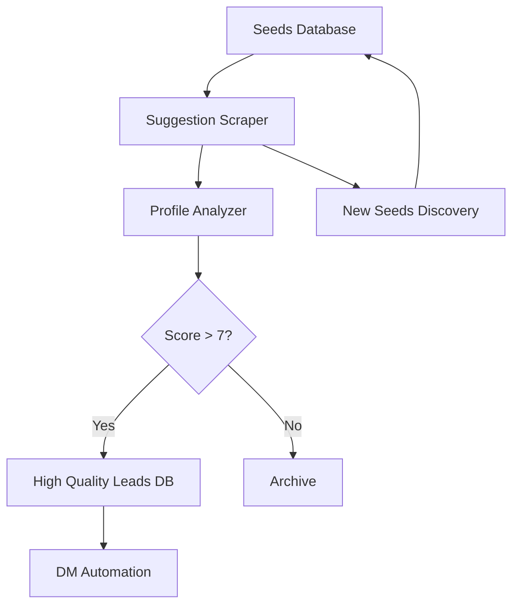

# 🎯 Stratégie Avancée d'Extraction de Profils Instagram/OF (2025)

## 🚨 Problème Actuel
- Configuration manuelle quotidienne des hashtags
- Qualité variable des leads
- Pas d'exploitation des suggestions de profils
- Processus non automatisé

## ✅ Solution Recommandée: Système Hybride Intelligent

### 1. 🔄 **Scraping des Suggestions Instagram (GAME CHANGER)**

#### Pourquoi c'est puissant:
- Instagram utilise un AI sophistiqué pour suggérer des profils similaires
- Les suggestions sont basées sur:
  - Followers partagés
  - Patterns d'engagement similaires
  - Contenu similaire (photos, hashtags)
  - Comportement utilisateur

#### Implémentation technique:
```javascript
// Nouveau module: instagram-suggestions-scraper.mjs
export class InstagramSuggestionsScraper {
  async getSuggestedProfiles(seedAccount) {
    // 1. Visiter le profil seed
    // 2. Cliquer sur "Followers" 
    // 3. Capturer les profils "Suggested for you"
    // 4. Pour chaque suggestion, répéter (graph traversal)
  }
}
```

### 2. 🎯 **Seeds Intelligents + Graph Traversal**

Au lieu de chercher par hashtags quotidiennement:

```
Étape 1: Identifier 10-20 "seeds" de haute qualité
  → Modèles confirmés avec OF actif
  → 10k-100k followers (sweet spot)
  → Engagement élevé

Étape 2: Graph Traversal Automatique
  Seed Account
      ↓
  Suggestions (20-30 profils similaires)
      ↓
  Pour chaque suggestion → nouvelles suggestions
      ↓
  Réseau exponentiel de profils qualifiés
```

### 3. 🤖 **Qualification Automatique par IA**

```javascript
// Scoring avancé des profils
function scoreProfile(profile) {
  let score = 0;
  
  // Bio indicators
  if (bio.match(/link in bio|OF|exclusive|content|creator/i)) score += 3;
  if (bio.match(/DM for|collab|promo/i)) score += 2;
  
  // Visual indicators (avec AI vision)
  if (hasLingeriePics) score += 2;
  if (hasProfessionalPhotos) score += 1;
  
  // Engagement patterns
  if (engagementRate > 5%) score += 2;
  if (recentActivity) score += 1;
  
  // Network analysis
  if (followsSimilarCreators) score += 2;
  
  return score;
}
```

### 4. 📊 **Pipeline Automatisé Complet**



## 🛠️ Architecture Technique Proposée

### Module 1: Smart Seeds Manager
```javascript
// src/smart-seeds-manager.mjs
export class SmartSeedsManager {
  constructor() {
    this.seeds = new Map();
    this.exploredProfiles = new Set();
  }
  
  async addSeed(username, metadata) {
    // Ajouter un compte seed vérifié
  }
  
  async getNextSeed() {
    // Retourner le prochain seed à explorer
    // Prioriser par performance
  }
}
```

### Module 2: Suggestions Crawler
```javascript
// src/suggestions-crawler.mjs
export class SuggestionsCrawler {
  async crawlSuggestions(username, depth = 2) {
    const profiles = [];
    
    // Niveau 1: Suggestions directes
    const directSuggestions = await this.getSuggestions(username);
    profiles.push(...directSuggestions);
    
    // Niveau 2: Suggestions des suggestions
    if (depth > 1) {
      for (const profile of directSuggestions.slice(0, 5)) {
        const secondLevel = await this.getSuggestions(profile.username);
        profiles.push(...secondLevel);
      }
    }
    
    return this.dedupeAndScore(profiles);
  }
}
```

### Module 3: AI Profile Analyzer
```javascript
// src/ai-profile-analyzer.mjs
export class AIProfileAnalyzer {
  async analyzeProfile(profile) {
    return {
      hasOF: await this.checkForOF(profile),
      quality: await this.assessQuality(profile),
      engagement: await this.calculateEngagement(profile),
      niche: await this.detectNiche(profile),
      location: await this.inferLocation(profile),
      active: await this.checkActivity(profile)
    };
  }
}
```

### Module 4: Automated Pipeline
```javascript
// src/automated-pipeline.mjs
export class AutomatedPipeline {
  async run() {
    // Exécution quotidienne automatique
    while (true) {
      // 1. Sélectionner seeds
      const seeds = await this.seedsManager.getActiveSeeds();
      
      // 2. Crawler suggestions
      for (const seed of seeds) {
        const suggestions = await this.crawler.crawlSuggestions(seed);
        
        // 3. Analyser et scorer
        for (const profile of suggestions) {
          const analysis = await this.analyzer.analyzeProfile(profile);
          
          if (analysis.quality > 7) {
            await this.leadsDB.addLead(profile, analysis);
          }
        }
      }
      
      // 4. Découvrir nouveaux seeds
      await this.discoverNewSeeds();
      
      // Pause 24h
      await this.sleep(24 * 60 * 60 * 1000);
    }
  }
}
```

## 📈 Avantages du Système

### 1. **Qualité Supérieure des Leads**
- Utilise l'IA d'Instagram pour trouver des profils vraiment similaires
- Scoring multi-critères sophistiqué
- Validation par patterns visuels et textuels

### 2. **Automatisation Totale**
- Plus de configuration manuelle quotidienne
- Découverte automatique de nouveaux seeds
- Pipeline qui tourne 24/7

### 3. **Scalabilité Exponentielle**
- 1 seed → 30 suggestions → 900 profils niveau 2
- 20 seeds = 18,000 profils qualifiés/jour
- Auto-apprentissage des meilleurs seeds

### 4. **Coût Réduit**
- Moins de requêtes API
- Meilleur ROI par lead
- Réutilisation des sessions Instagram

## 🚀 Plan d'Implémentation

### Phase 1: Proof of Concept (1 semaine)
- [ ] Créer module de scraping des suggestions
- [ ] Tester avec 5 seeds manuels
- [ ] Mesurer la qualité des leads

### Phase 2: Automatisation (2 semaines)
- [ ] Pipeline automatisé complet
- [ ] Intégration avec DM automation existante
- [ ] Système de scoring avancé

### Phase 3: Intelligence (2 semaines)
- [ ] AI vision pour analyse visuelle
- [ ] Machine learning pour optimiser seeds
- [ ] Dashboard analytics avancé

## ⚠️ Considérations Importantes

### Techniques Anti-Détection
- Rotation de sessions/proxies
- Comportement humain simulé
- Limites de crawl respectées
- Pause entre actions

### Stockage des Données
```sql
CREATE TABLE smart_leads (
  username VARCHAR(255) PRIMARY KEY,
  source_seed VARCHAR(255),
  discovery_path TEXT[],
  quality_score INT,
  has_of_probability FLOAT,
  last_analyzed TIMESTAMP,
  metadata JSONB
);

CREATE TABLE seed_performance (
  seed_username VARCHAR(255) PRIMARY KEY,
  leads_generated INT,
  conversion_rate FLOAT,
  quality_avg FLOAT,
  last_crawled TIMESTAMP
);
```

## 🎯 KPIs de Succès

- **Lead Quality Score**: >8/10 en moyenne
- **OF Confirmation Rate**: >70%
- **Découverte Quotidienne**: 1000+ profils qualifiés
- **Conversion DM→OF**: >15%
- **Coût par Lead Qualifié**: <$0.10

## 💡 Innovation Bonus: Network Effect

Plus le système tourne, plus il devient intelligent:
- Apprend quels seeds génèrent les meilleurs leads
- Identifie les patterns de profils performants
- S'adapte aux changements d'algorithme Instagram
- Découvre des niches émergentes automatiquement

---

**Conclusion**: Cette approche révolutionne la découverte de leads en exploitant l'intelligence d'Instagram elle-même. Au lieu de chercher aveuglément avec des hashtags, nous utilisons le graph social pour trouver des profils hautement qualifiés de manière automatique et scalable.